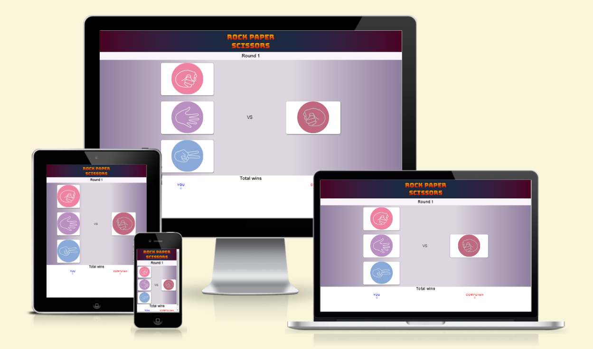
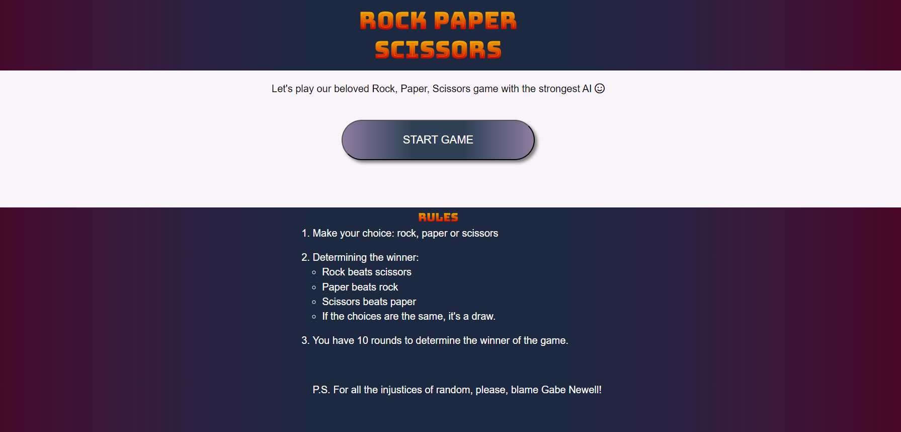
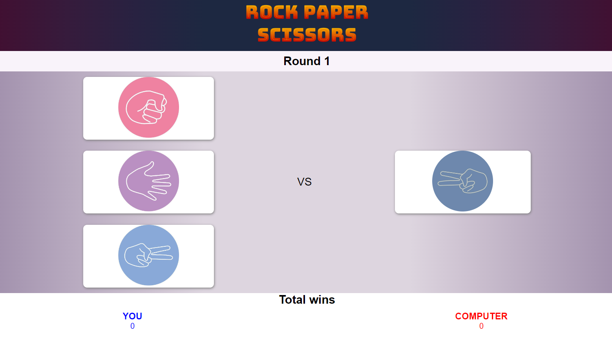
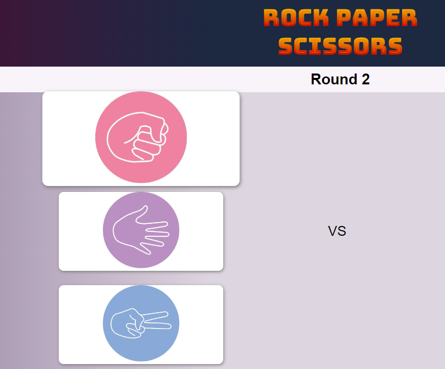
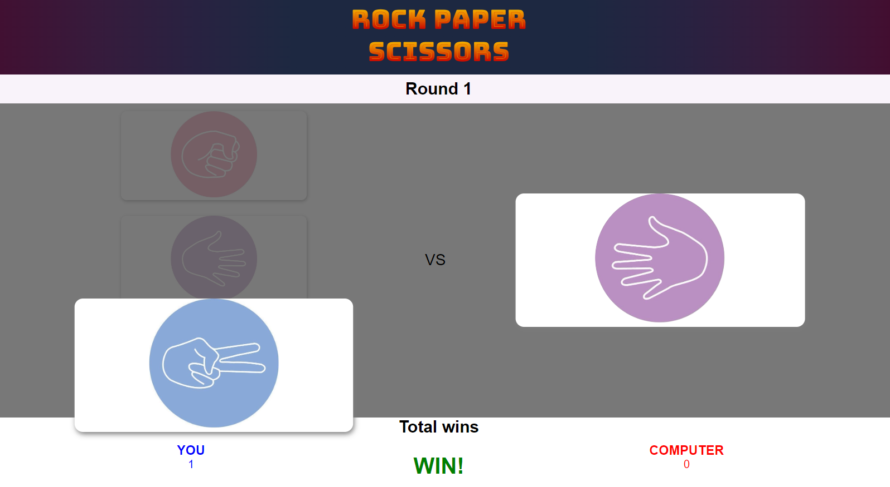
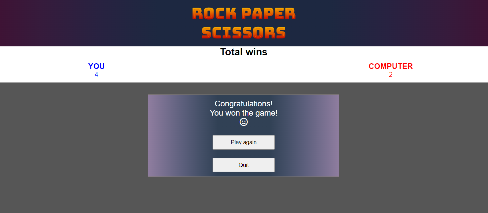

# Overview
This website is the second project in my Code Institute course.

It showcases various programming skills and methods that I acquired during the course.

Main languages used HTML, CSS, and JavaScript.

## About Website
The website is an interactive rock-paper-scissors game. The project was selected by one of the proposed options to choose from.
The website gives an opportunity to play a mini-game with the computer of 10 rounds. The user can choose one of the options, after which the computer makes its own random choice.
In each round a winner is determined based on the following logic: rock beats scissors, paper beats rock, scissors beats paper, with the same choice - the round ends in a draw.
After 10 rounds, the winner by the most wins is determined.

Link to the live site here: [Rock-paper-scissors Game](https://dionismaximus.github.io/rock-paper-scissors/)

## Features
- __Landing page__
  - Front landing page with a button to start the game centered.
  - Below the button, the user can check out the rules of the game.

- __Game page__
  - After clicking on start game, the game page and the first round opens.

- __Buttons__
  - All buttons are responsive and respond when hovering as well as when a selection is made.

- __Rounds__
  - After a user's choice and a computer's choice, the choices are compared and the winner of the round is determined with the output of the appropriate round result remark.

- __Final message__
  - After ten rounds, a message with the game total is displayed on the screen. Two buttons here allow the user to play another game or return to the landing page.

## Testing 
- I tested this page in different browsers. The site works fine.
- I confirmed that this website is responsive for all type of screen.
- I confirmed that the all pages, blocks and section are readable and easy to understand.
- I have confirmed that all buttons work correctly.

## Bugs
### Solved bugs
- After checked the code on HTML validation service that showed two errors.
- One image has two target attribute and one image has inappropriate name that has a space.
- Bugs have been fixed.

## Validator testing
- __HTML__
  - No errors were return after solved two previous errros when passing through the official W3C validator
- __CSS__
  - No errors were return when passing through the official (Jigsaw) validator
- __Accessibility__
  - I confirmed that the colors and font chosen are easily to read and understand with a high contrast ratio.
  - The website has been checked by running it through lighthouse in devtools

## Deployment
- __The site was deployed to GitHub pages. The steps to deploy are as follows:__
  - In the GitHub repository, navigate to the Settings tab
  - From the source section drop-down menu, select the Master Branch
  - Once the master branch has been selected< the page provided the link to the completed website

  

## Credits
### Content
- The code to make the navigation toggle bar for mobile version of the website partially was taken from the Love Running Project
### Media
- All icons was taken from [Font Awesome](https://fontawesome.com/)
- The images except our place page was taken from [Pexels](https://pexels.com/)
- The photos for our place page was taken from the official [The Linen Weaver - JD Wetherspoon Pub website](https://www.jdwetherspoon.com/pubs/all-pubs/republic-of-ireland/county-cork/the-linen-weaver-cork/)